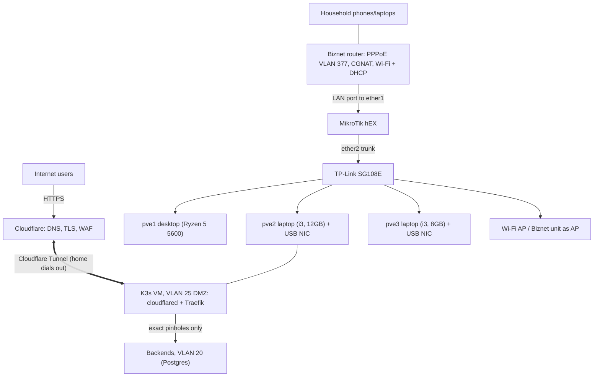

# Home Server Lab: Network Design v2

> **Living document.** Started as the v2 draft; it gets revised as the build
> progresses. Facts pinned against real hardware so far: the Biznet/household
> LAN is `192.168.18.0/24`; port roles are `ether1` = WAN, `ether3` = OOB
> management, `ether5` = trunk to switch P8; the hEX is managed by OpenTofu
> ([ADR 0001](../decisions/0001-opentofu-for-routeros.md)). A full v3 pass
> happens once the router baseline is applied.

**Scope:** Biznet fiber (CGNAT), MikroTik hEX (RB750Gr3), TP-Link SG108E, 3-node Proxmox cluster, public exposure through **Cloudflare Tunnel** ([ADR 0004](../decisions/0004-public-ingress-cloudflare-tunnel.md); the VPS path in §6 is a deferred fallback). The hEX sits **behind the existing Biznet router**, which keeps serving the household Wi-Fi untouched. **Principles:** zero inbound ports at home, VLAN segmentation with default-deny, the DMZ (tenant workloads) and any VPS treated as untrusted zones, out-of-band recovery path, everything reproducible from a config export.

## 1. Logical topology



**Upstream: Biznet router (left untouched)**

- It terminates PPPoE on VLAN 377 (MRU 1492) and receives a private 10.108.x.x address, which means **CGNAT**: no inbound connections from the internet, so all exposure goes through an outbound tunnel (Cloudflare Tunnel, ADR 0004).
- Its WAN connection, Wi-Fi bindings and DHCP stay exactly as they are, so household devices are unaffected. The hEX plugs into a free LAN port and acts as an ordinary client (double NAT behind CGNAT is fine for outbound WireGuard).
- No bridge mode, no DMZ, no PPPoE on the hEX. Reserve the hEX's WAN address in the Biznet DHCP if possible.
- The Biznet LAN subnet must not overlap 10.10.0.0/16, 192.168.99.0/29 or 192.168.88.0/24. If it does, change ours.
- **Known quirk (2026-10-07):** Biznet's internal/CGNAT network also uses `10.x`
  space (first CGNAT hop: `10.108.0.1`). From a device *without* a lab route,
  traffic to lab IPs escapes via the default route into the ISP network — and
  `10.10.10.13` phantom-answered ICMP from deep inside Biznet (TTL≈229).
  Harmless in normal operation (lab devices always have a correct route), but
  never trust a bare ping as proof of lab connectivity — check the route/TTL.
  Mitigation if it ever causes real problems: renumber the lab (e.g.
  `172.31.0.0/16`).
- IPv4 only in the lab. Biznet delegates a single /64, so leave IPv6 off on the hEX.
- Household devices cannot reach the lab: the hEX drops all input from `ether1` and nothing is forwarded in.

## 2. VLAN and IP plan

| VLAN | Name | Subnet | Gateway | Notes |
| --- | --- | --- | --- | --- |
| 1 | Native | 192.168.99.0/29 | .1 (hEX) | Switch management only; SG108E = .2 |
| 10 | MGMT | 10.10.10.0/24 | .1 | Proxmox hosts, PBS, admin |
| 20 | SERVERS | 10.10.20.0/24 | .1 | Production VMs/LXC, static IPs |
| 25 | DMZ | 10.10.25.0/24 | .1 | Edge LXC (WireGuard + reverse proxy) |
| 30 | LAB | 10.10.30.0/24 | .1 | Testing; internet only; DHCP .100-.199 |
| 40 | TRUSTED | 10.10.40.0/24 | .1 | Your devices; DHCP .100-.199 |
| 50 | IOT/GUEST | 10.10.50.0/24 | .1 | Internet only; DHCP .100-.199 |
| 60 | CLUSTER | 10.10.60.0/24 | none | Corosync/migration, L2 only, not on router |
| 999 | BLACKHOLE | none | none | Unused native VLAN for trunk ports |

**Static addresses**

| Host | MGMT (VLAN 10) | CLUSTER (VLAN 60) | Other |
| --- | --- | --- | --- |
| pve1 (desktop: Ryzen 5 5600, 32GB, RTX 3060) | 10.10.10.11 | 10.10.60.11 |  |
| pve2 (Asus i3 laptop, 12GB) | 10.10.10.12 | 10.10.60.12 |  |
| pve3 (Asus i3 laptop, 8GB) | 10.10.10.13 | 10.10.60.13 |  |
| PBS (future) | 10.10.10.14 |  |  |
| Postgres LXC (Kubeletto, future, pve2) |  |  | 10.10.20.21 (VLAN 20) |
| K3s VM (Kubeletto tenant cluster, future) |  |  | 10.10.25.20 (VLAN 25) |
| admin-gw LXC (Tailscale subnet router) | 10.10.10.15 |  |  |
| edge LXC (deferred VPS path only) |  |  | 10.10.25.10, wg 10.99.0.2 |
| hEX OOB (ether3) |  |  | 192.168.88.1/24 |
| VPS |  |  | wg 10.99.0.1 |

Internal DNS: hEX resolver, names under `home.arpa` (`network/routeros/dns.tf`). Public names (`kubeletto.com`, `kubeletto.app`) are authoritative on **Cloudflare DNS** only. No split-horizon: HSTS `includeSubDomains; preload` makes every public subdomain HTTPS-only, so LAN clients go through Cloudflare like everyone else.

## 3. SG108E configuration

Set the management IP to 192.168.99.2/29 (gateway 192.168.99.1) before installing it. Create VLANs 10, 20, 25, 30, 40, 50, 60 and 999. **Add VLAN membership first, then set PVIDs, then move cables.** Export the config backup when done.

| Port | Device | Untagged (PVID) | Tagged |
| --- | --- | --- | --- |
| P1 | Management / recovery laptop (normally unplugged) | 1 (1) | none |
| P2 | pve1 | 999 (999) | 10, 20, 25, 30, 60 |
| P3 | pve2 | 999 (999) | 10, 20, 25, 30, 60 |
| P4 | pve3 | 999 (999) | 10, 20, 25, 30, 60 |
| P5 | PBS / NAS (future) | 10 (10) | none |
| P6 | Optional Wi-Fi AP for your own devices (own SSID) | 40 (40) | none |
| P7 | Workstation | 40 (40) | none |
| P8 | hEX ether5 (trunk) | 1 (1) | 10, 20, 25, 30, 40, 50 |

VLAN 1 stays on **P1 and P8 only** — it is the management segment (`192.168.99.0/29`) shared with the hEX's `ether5` address. Remove every other port from VLAN 1 so an untagged VM can't land on the switch-management VLAN. VLAN 60 is not tagged on P8, so cluster traffic can never reach the router.

## 4. MikroTik hEX (RouterOS 7)

Port roles (as built): **ether1** WAN (cable to a free LAN port on the Biznet router), **ether3** out-of-band recovery, **ether5** trunk to switch P8, ether2/ether4 spare.

Reset with `no-defaults=yes`, connect via Winbox (MAC) on ether5, and apply the baseline below. Review it before pasting, and apply it in **Safe Mode**.

```routeros
/interface vlan
add name=vlan10-mgmt    interface=ether2 vlan-id=10
add name=vlan20-servers interface=ether2 vlan-id=20
add name=vlan25-dmz     interface=ether2 vlan-id=25
add name=vlan30-lab     interface=ether2 vlan-id=30
add name=vlan40-trusted interface=ether2 vlan-id=40
add name=vlan50-iot     interface=ether2 vlan-id=50

/ip address
add address=192.168.99.1/29 interface=ether2
add address=192.168.88.1/24 interface=ether5
add address=10.10.10.1/24 interface=vlan10-mgmt
add address=10.10.20.1/24 interface=vlan20-servers
add address=10.10.25.1/24 interface=vlan25-dmz
add address=10.10.30.1/24 interface=vlan30-lab
add address=10.10.40.1/24 interface=vlan40-trusted
add address=10.10.50.1/24 interface=vlan50-iot

/ip dhcp-client add interface=ether1 use-peer-dns=no add-default-route=yes
/ip dns set allow-remote-requests=yes servers=1.1.1.1,9.9.9.9

# DHCP for client VLANs (repeat for 30 and 50 with their subnets)
/ip pool add name=pool40 ranges=10.10.40.100-10.10.40.199
/ip dhcp-server add name=dhcp40 interface=vlan40-trusted address-pool=pool40 lease-time=12h
/ip dhcp-server network add address=10.10.40.0/24 gateway=10.10.40.1 dns-server=10.10.40.1

/interface list add name=WAN
/interface list add name=LAN
/interface list member
add list=WAN interface=ether1
add list=LAN interface=vlan10-mgmt
add list=LAN interface=vlan20-servers
add list=LAN interface=vlan25-dmz
add list=LAN interface=vlan30-lab
add list=LAN interface=vlan40-trusted
add list=LAN interface=vlan50-iot

/ip firewall nat add chain=srcnat out-interface-list=WAN action=masquerade

# PPPoE upstream (MRU 1492): clamp TCP MSS so large transfers don't stall
/ip firewall mangle
add chain=forward action=change-mss new-mss=clamp-to-pmtu passthrough=yes protocol=tcp tcp-flags=syn out-interface-list=WAN

/ip firewall address-list
add list=admin-src address=10.10.40.0/24
add list=admin-src address=10.10.10.0/24
add list=dmz-backends address=10.10.20.21 comment="add one entry per exposed backend"
add list=biznet-lan address=192.168.1.0/24 comment="VERIFY: actual Biznet LAN subnet"
add list=admin-gw address=10.10.10.15

/ip firewall filter
# input
add chain=input action=accept connection-state=established,related
add chain=input action=drop connection-state=invalid
add chain=input action=accept protocol=icmp
add chain=input action=accept in-interface-list=LAN protocol=udp dst-port=53,67
add chain=input action=accept in-interface-list=LAN protocol=tcp dst-port=53
add chain=input action=accept src-address-list=admin-src protocol=tcp dst-port=22,8291
add chain=input action=accept in-interface=ether5
add chain=input action=drop
# forward
add chain=forward action=fasttrack-connection connection-state=established,related
add chain=forward action=accept connection-state=established,related
add chain=forward action=drop connection-state=invalid
add chain=forward action=accept src-address=10.10.40.0/24 dst-address=10.10.0.0/16 comment="TRUSTED to internal"
add chain=forward action=accept src-address=10.10.25.0/24 dst-address-list=dmz-backends protocol=tcp dst-port=443,8080 comment="DMZ to backends only"
add chain=forward action=accept src-address-list=admin-gw dst-address=10.10.0.0/16 comment="admin-gw to internal"
add chain=forward action=drop dst-address-list=biznet-lan out-interface-list=WAN comment="lab must not reach Biznet/household LAN"
add chain=forward action=drop in-interface-list=LAN out-interface-list=LAN comment="drop other inter-VLAN"
add chain=forward action=accept in-interface-list=LAN out-interface-list=WAN
add chain=forward action=drop comment="default drop"
```

**Resulting policy**

| From \\ To | MGMT | SERVERS | DMZ | LAB | TRUSTED | IOT | Internet |
| --- | --- | --- | --- | --- | --- | --- | --- |
| TRUSTED | yes | yes | yes | yes | n/a | yes | yes |
| MGMT | n/a | no | no | no | no | no | yes |
| SERVERS | no | n/a | no | no | no | no | yes |
| DMZ | no | exact pinholes | n/a | no | no | no | capped, filtered |
| LAB | no | no | no | n/a | no | no | yes |
| IOT | no | no | no | no | no | n/a | yes |

The Biznet/household LAN is blocked from every lab VLAN (rule `biznet-lan`), and `admin-gw` is the only MGMT host allowed to reach other internal VLANs.

**DMZ = tenant zone (as built 2026-10-08).** VLAN 25 will run other people's
code (Kubeletto tenant workloads), and its egress leaves from the household's
public IP. So, beyond the table above:

- **No outbound SMTP** (`tcp/25` out WAN dropped and logged, prefix `dmz-smtp`).
  Submission ports (465/587) stay open.
- **No non-public destinations via WAN** (address list `non-public`: RFC1918,
  `100.64.0.0/10`, link-local; logged, prefix `dmz-private`). Biznet's CGNAT
  internals are `10.x`; tenants must not probe them.
- **Bandwidth cap** 50M/50M on DMZ ↔ internet (`/queue simple` `dmz-internet`,
  `dst=ether1`), so tenants cannot starve the household or corosync. The line
  measured ~90/90 Mbps. The DMZ is excluded from fasttrack, because fasttracked
  packets skip queues; every other VLAN keeps fasttrack.
- **Exact pinholes, not a list.** Each DMZ → backend path is its own rule
  (source, destination, port). First: K3s VM `10.10.25.20` → Postgres
  `10.10.20.21:5432` (hosts reserved, not built yet). The earlier generic
  `dmz-backends` list rule (443/8080) is gone.

- **Anti-spoofing.** Allow rules trust source addresses, so the hEX runs
  strict reverse-path filtering (`/ip settings rp-filter=strict`): a packet
  whose source is not routed back out its arrival interface is dropped. The
  source-based accepts also pin their `in-interface`. Without this, a DMZ guest
  could forge a TRUSTED or admin-gw source and be forwarded into MGMT.

Verified from a throwaway CT on VLAN 25: 443 and DNS work; SMTP-25, every
lab VLAN, the hEX admin ports, the switch, `192.168.18.1` and `10.108.0.1` are
blocked; throughput 48 Mbps vs 89 Mbps from VLAN 10.

Back up with `/export file=hex-baseline` (and a binary backup) after every change.

## 5. Proxmox networking (each node)

```
auto lo
iface lo inet loopback
iface eno1 inet manual

auto vmbr0
iface vmbr0 inet manual
    bridge-ports eno1
    bridge-stp off
    bridge-fd 0
    bridge-vlan-aware yes
    bridge-vids 10 20 25 30 60

auto vmbr0.10
iface vmbr0.10 inet static
    address 10.10.10.11/24
    gateway 10.10.10.1

auto vmbr0.60
iface vmbr0.60 inet static
    address 10.10.60.11/24
```

Use the adapter's real name instead of `eno1` (USB NICs show up as `enx...`). Increment the last octet per node. Create the cluster with corosync on the 10.10.60.x addresses. Guests get a VLAN tag in their NIC settings (20, 25 or 30). Don't enable HA on the USB-NIC nodes. Use an ASIX AX88179 or Realtek RTL8153 adapter. Schedule PBS jobs off-hours because corosync shares the single NIC.

## 6. Public exposure

**Current choice: Cloudflare Tunnel** ([ADR 0004](../decisions/0004-public-ingress-cloudflare-tunnel.md)).
Flow: user → Cloudflare (TLS, WAF, cache) → tunnel → `cloudflared` (2 replicas
inside the K3s VM, DMZ VLAN 25, outbound only) → Traefik → tenant services; the
K3s VM reaches its Postgres in VLAN 20 through one exact pinhole. Admin
surfaces never go through the tunnel (Tailscale only; Cloudflare Access if a
web UI must be public).

### 6b. Deferred fallback: VPS, L4 passthrough

Build only on an ADR 0004 trigger: non-HTTP ports, media or >100 MB uploads,
or tenant egress needing an exit IP other than the household's.

Flow: user → VPS:443 → HAProxy (PROXY protocol) → WireGuard → edge LXC Traefik/Caddy (terminates TLS, DNS-01 certificates) → backend in VLAN 20.

**VPS `/etc/wireguard/wg0.conf`**

```ini
[Interface]
Address = 10.99.0.1/30
ListenPort = 51820
PrivateKey = <vps-private-key>
MTU = 1420

[Peer]
PublicKey = <edge-public-key>
AllowedIPs = 10.99.0.2/32
```

**Edge LXC `/etc/wireguard/wg0.conf`**

```ini
[Interface]
Address = 10.99.0.2/30
PrivateKey = <edge-private-key>
MTU = 1420

[Peer]
PublicKey = <vps-public-key>
Endpoint = <VPS_PUBLIC_IP>:51820
AllowedIPs = 10.99.0.1/32
PersistentKeepalive = 25
```

**VPS HAProxy**

```
defaults
  mode tcp
  timeout connect 5s
  timeout client 1m
  timeout server 1m

frontend https_in
  bind :443
  default_backend home_https

backend home_https
  server edge 10.99.0.2:8443 send-proxy-v2 check
```

**Edge Traefik:** entrypoint `websecure` on `:8443` with PROXY protocol enabled and trusted IPs `10.99.0.1/32`; routes by hostname to backends in 10.10.20.0/24.

**Why the VPS can't pivot into the LAN**

- AllowedIPs on the VPS peer is only 10.99.0.2/32.
- IP forwarding is **off** on the edge LXC.
- The hEX only lets DMZ reach the `dmz-backends` allowlist.
- Edge firewall: accept inbound only on `wg0` to 8443.

**VPS hardening:** SSH keys only, no root login, SSH restricted to your IP or WireGuard; firewall allows only 51820/udp and exposed ports; CrowdSec or fail2ban; unattended security upgrades; no secrets stored; rebuild from cloud-init/Ansible. Choose a Jakarta or Singapore region.

**MTU:** the PPPoE path is 1492, so WireGuard stays at MTU 1420 (1420 + 60 bytes overhead is under 1492) and the hEX clamps TCP MSS (section 4).

**Remote admin (CGNAT, no inbound):** keep it completely separate from the exposure tunnel. Run Tailscale (or self-hosted Headscale on the VPS) in the `admin-gw` LXC at 10.10.10.15, advertising only the subnets you need, with ACLs allowing only your devices. Traffic is end-to-end encrypted, so a compromised VPS cannot read or inject admin traffic. Fallback: a WireGuard hub on the VPS with separate interface and keys, accepting that the VPS then becomes a trust point for admin traffic.

## 7. Operations

- **Backups:** PBS for VMs/LXC (target to be decided, ideally not on the same cluster), plus config exports for hEX, SG108E and VPS.
- **Resilience:** a small UPS for ONT, hEX, switch and nodes is worth it for power dips.
- **Monitoring (later):** Uptime Kuma or Prometheus on VLAN 10/20, with alerts if the public tunnel drops (an external check, so it still fires when home is down).

## 8. Build order and rollback

1. **Switch (offline):** connect a PC directly (default 192.168.0.1), set management IP, create VLANs, set membership then PVIDs, export config.
2. **hEX:** reset with `no-defaults`, connect via ether5, apply baseline in Safe Mode, export config.
3. **WAN:** check the Biznet LAN subnet (no overlap, update `biznet-lan`), then cable a free Biznet LAN port to hEX ether1. Leave the Biznet router's settings untouched, and confirm household Wi-Fi still works.
4. **Wire up:** hEX ether5 → SG108E P8 (trunk), laptop/recovery on P1, then connect nodes, AP and workstation.
5. **Proxmox:** apply `interfaces`, verify ping to the gateway on VLAN 10, create the cluster over VLAN 60.
6. **Public ingress:** Cloudflare DNS stack (import existing records), then the tunnel, then hostnames (ADR 0004).
7. **Verify:** see the checklist below.

**Rollback:** Safe Mode on the hEX undoes bad changes automatically; ether3 (OOB) and switch P1 (management) are always-available recovery paths; the Biznet router is never modified, so unplugging the hEX's `ether1` cable returns the household to exactly how it was.

**Verification checklist**

- Household Wi-Fi works before and after the hEX is plugged in.
- No lab VLAN can reach the Biznet LAN (ping the Biznet router's LAN IP from LAB; it must fail).
- LAB, IOT and SERVERS cannot reach MGMT or TRUSTED.
- IOT cannot reach any internal subnet; internet works from every VLAN.
- DMZ can reach only its exact pinholes; no SMTP-25 or non-public egress; internet capped (§4).
- Proxmox UI (8006) and SSH respond only from TRUSTED/MGMT.
- Large downloads through the tunnel don't stall (MTU/MSS check).
- Stopping `cloudflared` is detected by monitoring.

## 9. Open items

- Biznet LAN subnet: verify no overlap and set the `biznet-lan` entry.
- Own-device Wi-Fi for the lab later (optional AP on P6); until then use the wired workstation on P7.
- Remote admin: Tailscale chosen (`admin-gw`); tailnet policy as code and a second subnet router on pve2 still to do.
- Public exposure: decided (ADR 0004) — Kubeletto over Cloudflare Tunnel; VPS only on a trigger.
- PBS target and the role of the 8GB laptop (full member vs quorum-only).
- Wake-on-LAN for `pve1` (magic packet sent from an always-on laptop) so the on-demand AI node can boot remotely.
- VPS provider and region (only if an ADR 0004 trigger fires).
